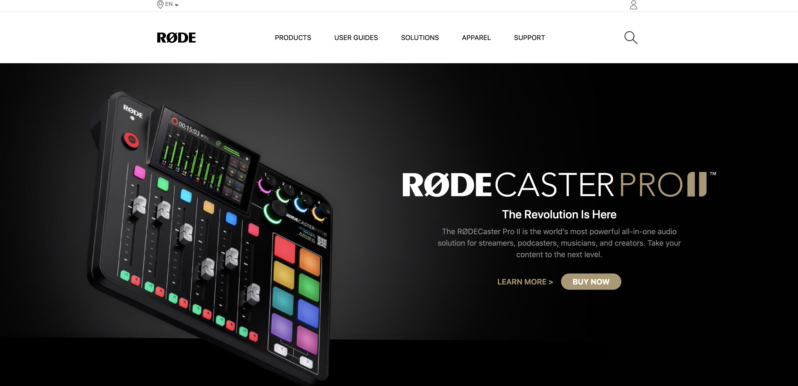

**Rode Clone using TAILWIND CSS**
--------------------------------------
-----------------------------------------
   

[Deployed Link](https://rode-clone-by-hs.netlify.app/)

What I learned from this Project?

- Implemented Responsive webpages using media query breakponts from Tailwind CSS
- Learned and implemented class, tag based selection of HTML elements.
- Learned to use flexbox and grid